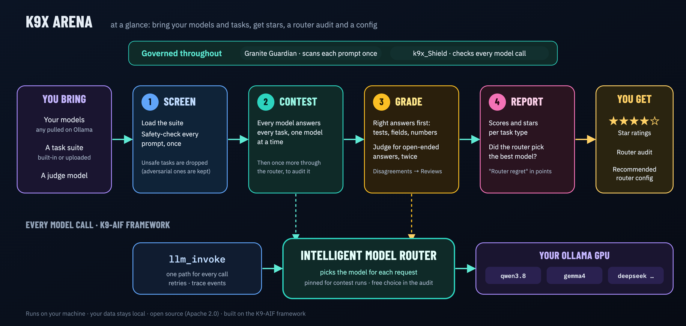

# K9X Arena

Put LLMs head to head on a task suite. K9X Arena grades every answer, awards
1–5 stars per model per task type, tests the K9-AIF **Intelligent Model
Router** (taught by the match's scores, does it pick the best model for a
task it hasn't seen?), and writes the `model_catalog` your router should use.

It runs on your own machine against your own Ollama models. Your prompts and
documents never leave it.



## What makes it different

- **Router test.** K9ModelRouter (k9-aif 1.13+) learns from graded results:
  it predicts each model's quality on a new prompt from similar prompts it
  has seen, as Not Diamond and RouteLLM do. After scoring, each task is
  hidden in turn; the router learns from the other tasks' scores and picks a
  model for it. Its picks are scored against the best possible pick, the best
  single model, your router config's rules and a random pick. No model is
  run again, so the test takes seconds.
- **Config you can paste.** Results end with a recommended `model_catalog`
  that uses only keys K9ModelRouter reads.
- **Governed by default.** Granite Guardian screens every task prompt and
  every upload, and fails closed: if Guardian is down, nothing runs.
  k9x_Shield checks prompts too.
- **Graded against right answers first.** Code runs its unit tests in a
  sandbox, extraction is checked field by field, reasoning against the
  expected answer. An LLM judge is used only for open-ended answers, twice,
  anonymized; disagreements go to a review queue.

## Quick start

You need Python 3.11+, an Ollama host, and the models you want to compare.

```bash
git clone https://github.com/k9aif/k9x-arena.git
cd k9x-arena
cp .env.example .env                 # set OLLAMA_BASE_URL and your model tags
ollama pull granite4.1-guardian:8b   # Guardian is mandatory
./run.sh                             # installs requirements (k9-aif from PyPI) and starts
```

`./run.sh` first runs a pre-flight check and stops with a clear message if
`.env` is missing, the Ollama host is unreachable, Granite Guardian isn't
pulled or doesn't answer, the judge isn't pulled, or no contender is pulled
(run it alone with `python -m arena.preflight`).

Open `http://localhost:8111` and sign in (`demo` / `demo` by default; set
`ARENA_ADMIN_PASSWORD` in `.env` to enable the admin login). Start with the
**Quick Check** suite (6 tasks) to see a full match in minutes, then run
**Claims Ops Starter** (30 tasks).

## Configuration

`.env` says *where* and *which*; `config.yaml` says *how*.

| `.env` | Meaning |
|---|---|
| `OLLAMA_BASE_URL` | Ollama host serving contenders, judge and Guardian |
| `ARENA_CONTESTANTS` | Contenders offered by default (any pulled model can be picked per match) |
| `ARENA_JUDGE_MODEL` | Judge for open-ended answers; never also a contender |
| `ARENA_ROUTER_GENERAL_MODEL`, `ARENA_ROUTER_REASONING_MODEL` | Your router config, scored as the "your rules" baseline in the router test |
| `ARENA_GUARDIAN_MODEL` | Granite Guardian model (mandatory) |
| `ARENA_USER` / `ARENA_PASSWORD`, `ARENA_ADMIN_USER` / `ARENA_ADMIN_PASSWORD` | Logins |

`config.yaml` holds runs per task, scoring weights, star thresholds, judge
passes, the review rule, the code sandbox timeout and the router-under-test
capabilities.

## How a match runs


1. **SuiteSquad**: load the suite; screen every prompt with k9x_Shield and Granite Guardian.
2. **ContestantSquad**: run every task on every contender (grouped by model so the GPU swaps rarely).
3. **GradingSquad**: deterministic graders, Guardian's safety pass on adversarial answers, then two judge passes.
4. **ReportSquad**: scores and stars, the held-out router test, recommended config.

Every model call goes through the framework's `llm_invoke` and K9ModelRouter.
To pin a task to one contender, each contender gets its own catalog entry with
a unique capability, so even forced runs are routed by the router itself.

## Container (Ubuntu / Podman)

Like the other K9X components, `ubuntu/` builds and runs a single container on
port **8111**, reading your `.env` at start. Match history lives in
`~/containers/volumes/k9x-arena/runtime` on the host, so it survives rebuilds.

```bash
./ubuntu/build-run.sh all     # build + start
./ubuntu/build-run.sh logs    # pre-flight results appear first
```

If the pre-flight fails, the container stops and the log says why.

## Your own tasks

Upload a task suite (`.yaml`, same format as `suites/`) or a source document
(`.md`, `.txt`) that becomes summary and question tasks. Every upload is
pre-checked, then Granite Guardian scans each task prompt once, at upload;
matches reuse those verdicts. A normal task that Guardian flags gets the upload
rejected (adversarial tasks are expected to be flagged).

Built-in suites in `suites/` ship with the arena and are trusted: they are not
Guardian-scanned at match time (k9x_Shield still checks every contender call).
If you edit them locally, that is your own review.

## Tests

```bash
pip install -r requirements-dev.txt
pytest tests -q
```

## Fair timing

- Each contender gets one untimed warm-up call before its turn, so model
  loading never counts as latency.
- Answers under 1 s (`arena.scoring.latency_floor_ms`) get full speed marks.
- During each turn the arena asks Ollama (`/api/ps`) how much of the model is
  in GPU memory. If a contender ran partly on the CPU because other models
  held VRAM, its timings aren't comparable: latency is left out of that
  match's scores, and Results says so.
- Results show answer quality next to every overall score, with an
  Overall / Answer quality toggle; "Best" and the winner follow quality
  first, with speed only breaking ties.

## Status and limits

- One match at a time (one GPU). Matches can be paused and resumed.
- Judge disagreements go to an in-app review queue; routing them to K9X HIL
  is planned.
- The router test needs several similar tasks per type. On Quick Check (one
  task per type) nothing is similar, so the rules decide every pick and the
  page says so; use Claims Ops Starter or your own suite.
- The default prompt embedder matches wording, not meaning. For semantic
  matching set `arena.router_test.learning.embedder: service` (Ollama
  `nomic-embed-text`).
- Feeding a match's evidence into your production router's store is planned.

See [SPEC.md](SPEC.md) and [project_plan.md](project_plan.md).

Part of the [K9X ecosystem](https://github.com/k9aif/k9x-ecosystem), built on
the [K9-AIF framework](https://github.com/k9aif/k9-aif-framework). Apache 2.0.
